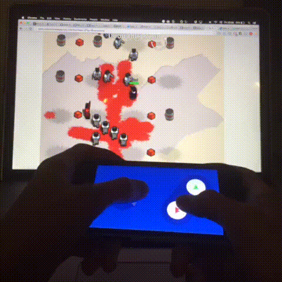

# LudumPad

Use mobile devices as smart game controllers. Work in progress.

## Packages

All related packages are hosted under this same repo – it's a monorepo. For now, at least.

 * [ludumpad-client]: LudumPad controller implementation. It currently fits the iPhone 6's screen only.
 * [ludumpad-server]: Spawn LudumPad servers and communicate with controllers.
 * [ludumpad-mapper]: Map keys to LudumPad input.

## License

LGPL-3.0 © [David da Silva]

[ludumpad-client]:https://github.com/dasilvacontin/ludumpad/tree/master/packages/ludumpad-client
[ludumpad-server]:https://github.com/dasilvacontin/ludumpad/tree/master/packages/ludumpad-server
[ludumpad-mapper]:https://github.com/dasilvacontin/ludumpad/tree/master/packages/ludumpad-mapper
[David da Silva]: http://dasilvacont.in
